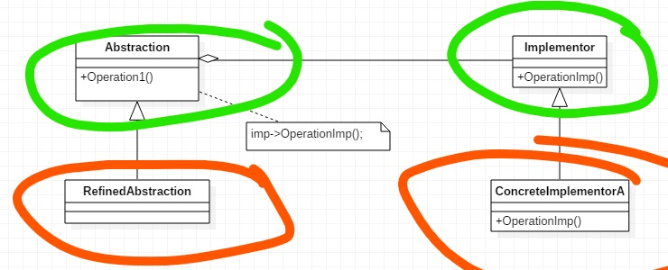

---
layout: post
title: '桥接模式 Bridge'
tags:
    - 设计模式
---  
  
  
#  桥接模式 Bridge
  
- [桥接模式 Bridge](#桥接模式-bridge)
  - [案例](#案例)
  - [优化](#优化)
  - [总结](#总结)
    - [分类](#分类)
    - [意图与动机](#意图与动机)
    - [结构](#结构)
    - [适用性](#适用性)
    - [效果](#效果)
  
##  案例

多平台的聊天室。

代码如下：
  
```ts
// Messager
  
namespace Bridge_demo1 {
  export class Messager {
    login() {
      return;
    }
    send() {
      return;
    }
    read() {
      return;
    }
  
    playSound() {
      return;
    }
    connect() {
      return;
    }
    readText() {
      return;
    }
    writeText() {
      return;
    }
  }
  
  // 不同平台，这两个方法有不同的实现
  export class PcMessagerBase extends Messager {
    playSound() {
      // do something
      return;
    }
    connect() {
      // do something
      return;
    }
    readText() {
      // ......
      return;
    }
    writeText() {
      // ......
      return;
    }
  }
  
  export class MobileMessagerBase extends Messager {
    playSound() {
      // do something
      return;
    }
    connect() {
      // do something
      return;
    }
    readText() {
      // ......
      return;
    }
    writeText() {
      // ......
      return;
    }
  }
  
  // 业务不同
  export class PcMessagerLite extends PcMessagerBase {
    login() {
      super.connect();
      // .....
      return;
    }
    send() {
      super.writeText();
      return;
    }
    read() {
      super.readText();
      return;
    }
  }
  
  export class PcMessagerPerfect extends PcMessagerBase {
    login() {
      super.connect();
      // .....
      return;
    }
    send() {
      super.writeText();
      return;
    }
    read() {
      super.readText();
      return;
    }
  }
  
  export class MobileMessagerLite extends MobileMessagerBase {
    login() {
      super.connect();
      // .....
      return;
    }
    send() {
      super.writeText();
      return;
    }
    read() {
      super.readText();
      return;
    }
  }
  
  export class MobileMessagerPerfect extends MobileMessagerBase {
    login() {
      super.connect();
      // .....
      return;
    }
    send() {
      super.writeText();
      return;
    }
    read() {
      super.readText();
      return;
    }
  }
}
  
/**
 * 基类 1
 * 平台 n
 * 业务 m
 * 子类数量可能有 1 + n + m*n 个。
 *
 * 存在大量重复代码。
 * 和Decorator类似
 */
  
```  
  
- 子类急剧膨胀
- 代码大量重复
  
##  优化
  
  
```ts
// Messager
  
namespace Bridge_demo2 {
  export abstract class Messager {
    abstract login(): void;
    abstract send(): void;
    abstract read(): void;
  
    abstract playSound(): void;
    abstract connect(): void;
    abstract readText(): void;
    abstract writeText(): void;
  }
  
  // 不同平台，这两个方法有不同的实现
  // 此时还有 部分方法未被实现
  export abstract class PcMessagerBase extends Messager {
    playSound() {
      // do something
      return;
    }
    connect() {
      // do something
      return;
    }
    readText() {
      // ......
      return;
    }
    writeText() {
      // ......
      return;
    }
  }
  
  export abstract class MobileMessagerBase extends Messager {
    playSound() {
      // do something
      return;
    }
    connect() {
      // do something
      return;
    }
    readText() {
      // ......
      return;
    }
    writeText() {
      // ......
      return;
    }
  }
  
  // 业务不同
  export class MessagerLite {
    messager!: Messager; // 运行时动态绑定 PcMesssagerBase， 但此时其并未完全实现。
  
    constructor(messager: Messager) {
      this.messager = messager;
    }
  
    login() {
      this.messager.connect();
      // .....
      return;
    }
    send() {
      this.messager.writeText();
      return;
    }
    read() {
      this.messager.readText();
      return;
    }
  }
  export class MessagerPerfect {
    messager!: Messager; // 运行时动态绑定
  
    constructor(messager: Messager) {
      this.messager = messager;
    }
    login() {
      this.messager.connect();
      // .....
      return;
    }
    send() {
      this.messager.writeText();
      return;
    }
    read() {
      this.messager.readText();
      return;
    }
  }
}
  
/**
 * 装饰器模式并未能完全解决问题
 * 因为在不同维度的子类，只重写了部分父类的方法
 * 需要将其拆分开来
 */
  
```  
  
- 改继承为组合，解决代码重复与子类膨胀问题
- 此时组合对象 类 仍为抽象类，不能再运行时绑定
  
```ts
// Messager
// 有两个变化的维度。
// 平台实现
// 业务抽象
namespace Bridge_demo3 {
  // 业务抽象，内部绑定一个平台实现
  export abstract class Messager {
    messagerImp!: MessagerIMP;
  
    constructor(messagerImp: MessagerIMP) {
      this.messagerImp = messagerImp;
    }
  
    abstract login(): void;
    abstract send(): void;
    abstract read(): void;
  }
  
  // 将平台实现抽象出来
  export abstract class MessagerIMP  {
    abstract playSound(): void;
    abstract connect(): void;
    abstract readText(): void;
    abstract writeText(): void;
  }
  
  // 不同平台，这两个方法有不同的实现
  export class PcMessagerBase extends MessagerIMP {
    playSound() {
      // do something
      return;
    }
    connect() {
      // do something
      return;
    }
    readText() {
      // ......
      return;
    }
    writeText() {
      // ......
      return;
    }
  }
  
  export class MobileMessagerBase extends MessagerIMP {
    playSound() {
      // do something
      return;
    }
    connect() {
      // do something
      return;
    }
    readText() {
      // ......
      return;
    }
    writeText() {
      // ......
      return;
    }
  }
  
  // 业务不同，实现业务逻辑
  export class MessagerLite extends Messager {
    constructor(messagerImp: MessagerIMP) {    // 动态绑定，此时PcMessagerBase已实现。
      super(messagerImp);
    }
  
    login() {
      this.messagerImp.connect();
      // .....
      return;
    }
    send() {
      this.messagerImp.writeText();
      return;
    }
    read() {
      this.messagerImp.readText();
      return;
    }
  }
  
  export class MessagerPerfect extends Messager {
    constructor(messagerImp: MessagerIMP) {
      super(messagerImp);
    }
    login() {
      this.messagerImp.connect();
      // .....
      return;
    }
    send() {
      this.messagerImp.writeText();
      return;
    }
    read() {
      this.messagerImp.readText();
      return;
    }
  }
}
  
```  
  
- 分离成两个
  
##  总结
  
  
###  分类
  
  
- 对象结构型模式
- 单一职责模式[^type]
  
###  意图与动机
  
  
- 将抽象部分（业务功能）与它的实现部分（平台实现）分离，使他们都可以独立的变化
- 由于某些类型的固有的实现逻辑，使得它们具有两个变化的维度，乃至多个维度的变化
- 各个变化部分又需要一起合作完成功能，单独一方面并无意义。（和装饰器模式的区别，装饰器可以延各个方向变化。）
- 如何应对这种多维度的变化？如何利用面向对象技术来使得类型可以轻松的沿着两个乃至多个方向变化，而不引入额外的负责度？
  
###  结构
  
  

  
- 绿色 稳定
- 红色 变化
  
###  适用性
  
- 不希望抽象与实现之间有固定的绑定关系。希望再运行时可以选择和切换
- 类的抽象以及它的实现都可以通过生成子类的方式进行扩充。对不同的抽象和实现之间进行组合
- 对一个抽象的实现部分的修改不会影响到客户
- 对客户隐藏部分的抽象实现部分
- 有许多类要生成
- 多个对象间共享实现
  
###  效果
  
  
- Bridge模式使用“对象间的组合关系”解耦了抽象与实现之间固有的绑定关系，使得抽象和实现可以沿着各自的维度来变化。所谓抽象和实现沿着各自维度的变化，即“子类化它们”
- Bridge模式有时候类似于多继承方案，但是多继承方案往往违背单一职责原则（即，一个类只有一个变化的原因），复用性比较差。Bridge模式是比多继承方案更好的解决方案
- Bridge模式的应用一般在“两个非常强的变化维度”，有时一个类也有多余两个的变化维度，这是可以使用Bridge的扩展模式。
  
[TOP](#title-home ) 跳转标题
  
> [返回首页](../index.html )
  
[^type]: [设计模式分类](./page/degisn_patterns-2.5.html )
[^principle]: [设计模式原则](./page/degisn_patterns-2.html )
  