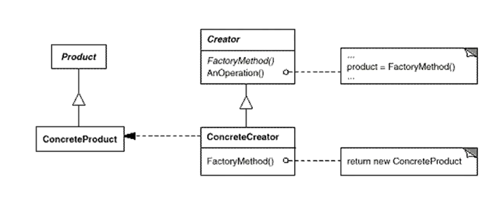

---
layout: post
title: '工厂模式 Factory'
tags:
    - 设计模式
---  
  
  
# 工厂模式 Factory
  

<!-- @import "[TOC]" {cmd="toc" depthFrom=1 depthTo=6 orderedList=false} -->

<!-- code_chunk_output -->

- [工厂模式 Factory](#工厂模式-factory)
  - [案例](#案例)
  - [优化](#优化)
  - [总结](#总结)
    - [分类](#分类)
    - [意图与动机](#意图与动机)
    - [结构](#结构)
    - [效果](#效果)
    - [延迟而非更改](#延迟而非更改)

<!-- /code_chunk_output -->

## 案例
  
改进文件分割器。

- 本来的分割器只支持一种文件的分割，现在我们需要支持多种文件的分割。
  - 首先，可以声明多个分割器。
  - 此时，为了将依赖延迟到运行时，我们声明分割器基类。在App中声new分割器对象，并使用。
  - 但此时有个问题
    - 在App中，我们必须实例化（new）一个一个分割器对象，此时App客户程序与分割器之间存在紧耦合的关系，那么该如何减弱这种关系呢
  
代码如下：
  
```ts
// 一个对象的类型，应该声明成抽象的接口或类，以应对未来的变化
interface ISplitter {
  split(): void;
}

class BianrySplitter implements ISplitter {
  split() {
    // do something
  }
}
class TxtSplitter implements ISplitter {
  split() {
    // do something
  }
}
class PictureSplitter implements ISplitter {
  split() {
    // do something
  }
}

class App {
  button_click() {
    // 面向接口编程，显著特征变量声明成接口、基类
    // 违背依赖倒置，new 实现细节
    const splitter: ISplitter = new BianrySplitter();
    splitter.split();
  }
}
  
```  
  
## 优化
  
使用工厂模式

- 利用工厂模式，绕过new过程，将对象的实例化与调用分离
  
```ts
// 一个对象的类型，应该声明成抽象的接口或类，以应对未来的变化

namespace Factory_demo2 {
  interface ISplitter {
    split(): void;
  }

  // 抽象工厂
  abstract class SplitterFactory {
    // 使用抽象类，将编译时绑定转为运行时绑定
    abstract createSplitter(): ISplitter;
  }

  // 具体工厂
  class BianrySplitterFactory extends SplitterFactory {
    createSplitter() {
      return new BianrySplitter();
    }
  }
  class TxtSplitterFactory extends SplitterFactory {
    createSplitter() {
      return new TxtSplitter();
    }
  }
  class PictureSplitterFactory extends SplitterFactory {
    createSplitter() {
      return new PictureSplitter();
    }
  }

  class BianrySplitter implements ISplitter {
    split() {
      // do something
    }
  }
  class TxtSplitter implements ISplitter {
    split() {
      // do something
    }
  }
  class PictureSplitter implements ISplitter {
    split() {
      // do something
    }
  }

  class App {
    // 使用抽象工厂，解除耦合关系
    factory: SplitterFactory;

    // 未来传入具体factory
    // 未来创建对象的地方会有依赖，但是在这里，已经解决了依赖关系。
    // 松耦合并不是消灭依赖（变化），而是将其（变化）赶到一个局部的地方
    constructor(factory: SplitterFactory) {
      this.factory = factory;
    }

    button_click() {
      // 面向接口编程，显著特征变量声明成接口、基类
      // 违背依赖倒置，new 实现细节
      const splitter: ISplitter = this.factory.createSplitter(); // 可以看成一个多态的new
      splitter.split();
    }
  }
}  
```  

- 此时在App中，只需要注入一个工厂类即可，并不用去关心对象如何新建，可以看成一个多态的new
- 如果有新的需求，只需新建实现类与工厂类即可。
- 在运行时，势必会在某个地方new对象
- 松耦合并不是消灭依赖（变化），而是将器（变化）赶到一个地方，隔离变化
  
## 总结
  
### 分类
  
- 对象创建型模式
- 对象创建模式[^type]
  
### 意图与动机
  
- 软件创建过程中，经常面临着创建对象的工作；由于需求的变化，需要创建的对象的具体类型经常变化
- 如何应对这种变化？如何绕过new？提供一种“封装手段”来隔离对象的新建和使用。
- 定义一个用于创建对象的接口，让子类决定实例化哪个类。Factory Method使得一个类的实例化延迟（延迟就是支持了变化）（目的：解耦，手段：抽象函数）到子类
  
### 结构
  

  
- 绿色 稳定
- 红色 变化
  
### 效果
  
- 可以看作抽象工厂模式的特例，只生产一种对象。
- Factory Method 用户隔离类对象的使用者和具体类型之间的耦合关系。面对一个经常变化的具体类型，紧耦合关系（new）会导致软件的脆弱。
- Factory Method 模式通过面向对象的手法，将所要创建的具体对象工作延迟到子类，从而实现一种扩展（而非更改，未来新增的时候，增加子类即可）的策略，较好的解决了这种紧耦合关系。
- Factory Method 模式解决“单个对象”的需求变化。缺点在于要求创建方法/参数相同（js rest参数 解决）。

### 延迟而非更改

- 修改前
  - 需求变化之后，需要直接修改代码
- 修改后
  - 只需新增工具类，和工厂类。对于使用者并无影响
  
[TOP](#title-home ) 跳转标题
  
> [返回首页](../index.html )
  
[^type]: [设计模式分类](./page/degisn_patterns-2.5.html )
[^principle]: [设计模式原则](./page/degisn_patterns-2.html )
  