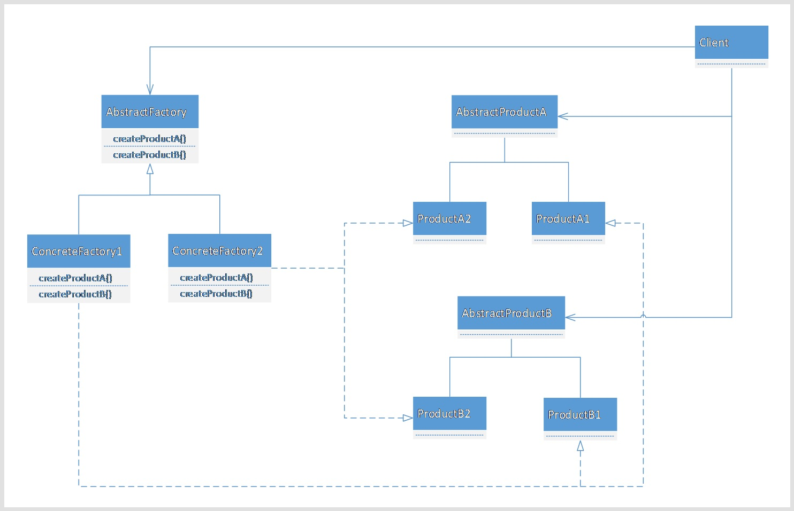

---
layout: post
title: '抽象工厂模式 Abstract-Factory'
tags:
    - 设计模式
---  

# 抽象工厂模式 Abstract-Factory
  

<!-- @import "[TOC]" {cmd="toc" depthFrom=1 depthTo=6 orderedList=false} -->

<!-- code_chunk_output -->

- [抽象工厂模式 Abstract-Factory](#抽象工厂模式-abstract-factory)
  - [案例](#案例)
  - [优化](#优化)
  - [再优化](#再优化)
  - [总结](#总结)
    - [分类](#分类)
    - [意图与动机](#意图与动机)
    - [结构](#结构)
    - [效果](#效果)

<!-- /code_chunk_output -->

## 案例
  
实现数据库连接与执行。
  
代码如下：
  
```ts
namespace AbstractFacroty_demo1 {
  class SqlConnection {
    connectionString: string;
  }

  class SqlCommand {
    commandText: string;
    executeReader() {
      return new SqlDataReader();
    }
  }

  class SqlDataReader {
    read() {
      return [];
    }
  }

  class EmployedDAO {
    getEmployees() {
      const sqlConnection = new SqlConnection();
      sqlConnection.connectionString = "...";

      const sqlCommand = new SqlCommand();
      sqlCommand.commandText = "...";

      const data = sqlCommand.executeReader();

      while (data.read()) {
        //do something
      }
    }
  }

  // 如果需要支持的数据库怎么办
  // new 紧耦合需要去除
}
```  
  
## 优化
  
使用工厂模式

- 利用工厂模式，绕过new过程，将对象的实例化与调用分离
  
```ts
namespace AbstractFacroty_demo2 {
  // 面向接口编程

  // 数据库访问有关的基类。
  abstract class DBConnection {
    connectionString: string;
  }
  abstract class DBCommand {
    commandText: string;
    connection: DBConnection;

    setConnection(connection: DBConnection) {
      this.connection = connection;
    }
    abstract executeReader(): DBDataReader;
  }
  abstract class DBDataReader {
    abstract read(): any[];
  }

  // 抽象工厂类
  abstract class DBConnectionFactory {
    abstract createDBConnection(): DBConnection;
  }
  abstract class DBCommandFactory {
    abstract createDBCommand(): DBCommand;
  }
  abstract class DBDataReaderFactory {
    abstract createDBDataReader(): DBDataReader;
  }

  // 具体工厂类
  class SqlConnectionFactory extends DBConnectionFactory {
    createDBConnection() {
      return new SqlConnection();
    }
  }
  class SqlCommandFactory extends DBCommandFactory {
    createDBCommand() {
      return new SqlCommand();
    }
  }

  // 支持sqlServer
  class SqlConnection extends DBConnection {}

  class SqlCommand extends DBCommand {
    executeReader() {
      return new SqlDataReader();
    }
  }

  class SqlDataReader extends DBDataReader {
    read() {
      return [];
    }
  }

  class EmployedDAO {
    sqlConnectionFactory: DBConnectionFactory;
    sqlCommandFactory: DBCommandFactory;

    constructor(sqlConnectionFactory: DBConnectionFactory, sqlCommandFactory: DBCommandFactory) {
      this.sqlConnectionFactory = sqlConnectionFactory;
      this.sqlCommandFactory = sqlCommandFactory;
    }

    getEmployees() {
      const sqlConnection = this.sqlConnectionFactory.createDBConnection();
      sqlConnection.connectionString = "...";

      const sqlCommand = this.sqlCommandFactory.createDBCommand();
      sqlCommand.setConnection(sqlConnection);
      sqlCommand.commandText = "...";

      const data = sqlCommand.executeReader();

      while (data.read()) {
        //do something
      }
    }
  }

  //此时。DBConnectionFactory，DBCommandFactory应该具有关联性，但是现在无法避免此种情况
}
```  

- 使用工厂模式，解除了耦合
- 但是此时因为需要多个对象协同合作，不能保证传入的对象的相匹配的

## 再优化

~~~ts
namespace AbstractFacroty_demo3 {
  // 面向接口编程
  // 考虑将三个工厂，放在一起

  // 数据库访问有关的基类。
  abstract class DBConnection {
    connectionString: string;
  }
  abstract class DBCommand {
    commandText: string;
    connection: DBConnection;
    setConnection(connection: DBConnection) {
      this.connection = connection;
    }
    abstract executeReader(): DBDataReader;
  }
  abstract class DBDataReader {
    abstract read(): any[];
  }

  // 抽象工厂类
  abstract class DBFactory {
    // 放在一起，保持相关性
    abstract createDBConnection(): DBConnection;
    abstract createDBCommand(): DBCommand;
  }

  // 具体工厂类
  class SqlDBFactory extends DBFactory {
    createDBConnection() {
      return new SqlConnection();
    }
    createDBCommand() {
      return new SqlCommand();
    }
  }

  // 支持sqlServer
  class SqlConnection extends DBConnection {}

  class SqlCommand extends DBCommand {
    executeReader() {
      return new SqlDataReader();
    }
  }

  class SqlDataReader extends DBDataReader {
    read() {
      return [];
    }
  }

  class EmployedDAO {
    sqlDBFactory: DBFactory;

    constructor(sqlDBFactory: DBFactory) {
      this.sqlDBFactory = sqlDBFactory;
    }

    getEmployees() {
      const sqlConnection = this.sqlDBFactory.createDBConnection();
      sqlConnection.connectionString = "...";

      const sqlCommand = this.sqlDBFactory.createDBCommand();
      sqlCommand.setConnection(sqlConnection);
      sqlCommand.commandText = "...";

      const data = sqlCommand.executeReader();

      while (data.read()) {
        //do something
      }
    }
  }

  //此时。DBConnectionFactory，DBCommandFactory应该具有关联性，但是现在无法避免此种情况
}
~~~

- 本来一个工厂生产一个对象，现在让他生产一系列的对象，保证了对象间的关系
  
## 总结
  
### 分类
  
- 对象创建型模式
- 对象创建模式[^type]
  
### 意图与动机
  
- 在软件系统中，经常面临着“一系列相互依赖对象”的创建工作；同时，由于需求的变化，有更多的系列对象需要创建
- 如何应对这种变化？如何绕过new。提供一种封装机制来避免客户程序和这种“多系列具体对象创建工作”的紧耦合？
- 提供一个创建一系列相关或相互依赖对象（和工厂方法不同）的接口，而无需指定他们具体的类。
- 提供一个抽象工厂，定义相关的抽象接口，由具体的工厂实现。便于新增产品工厂。此时一个工厂不仅仅只生产一种对象。
  
### 结构
  

  
- 绿色 稳定
- 红色 变化
  
### 效果
  
- 将客户程序与具体类的实例化隔离开来。
- 它使得易于交换产品系列。
- 它有利于产品的一致性。
- ==难以==支持新对象的需求变动（需要修改一系列的工厂，抽象工厂应该是稳定的）。
  
[TOP](#title-home ) 返回顶部
  
[^type]: [设计模式分类](./page/degisn_patterns-2.5.html )
[^principle]: [设计模式原则](./page/degisn_patterns-2.html )
  