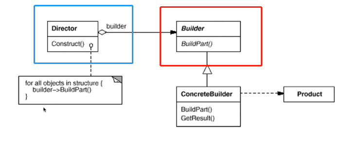

---
layout: post
title: '建造模式 Builder'
tags:
    - 设计模式
---  
  
  
  
#   建造模式 Builder
  
  
- [建造模式 Builder](#建造模式 Builder )
  - [示例](#示例 )
  - [动机&意图](#动机意图 )
  - [类别](#类别 )
  - [结构](#结构 )
  - [总结](#总结 )
  
##   示例
  
  
> 建造房子，需要打地基、砌墙、装水电、装屋顶、装窗、装修等步骤
> 建造木房子，也需要这些步骤，但是实现不一样
  
~~~ts
/**
 * 建造房子
 */
class _House {
    buildPart1() {
        return true;
    }
    buildPart2() {
        return true;
    }
    buildPart3() {
        return true;
    }
    buildPart4() {
        return true;
    }
    buildPart5() {
        return true;
    }
  
    // 构建过程是一样的
    // 对象过于复杂时，需要拆分
    init() {
        this.buildPart1()
        for(let i=4;i<4;i++) {
            this.buildPart2();
        }
        const flag = this.buildPart3();
        if (flag) {
            this.buildPart4
        }
        this.buildPart5();
    }
}
  
class House {
    // House 基本属性等等
}
  
/**
 * house各个部分的建造方法 
 */
class HouseBuilder {
    pHouse:House;
  
    buildPart1(){
        // dosomething
        return true;
    }
    buildPart2(){
        // dosomething
        return true;
    }
    buildPart3(){
        // dosomething
        return true;
    }
    buildPart4(){
        // dosomething
        return true;
    }
    buildPart5(){
        // dosomething
        return true;
    }
  
    getResult() {
        return this.pHouse;
    }
}
  
/**
 * house 的整体建造流程
 */
class HouseDirector {
    constructor(pHouseBuilder:HouseBuilder) {
        pHouseBuilder.buildPart1()
        for(let i=4;i<4;i++) {
            pHouseBuilder.buildPart2();
        }
        const flag = pHouseBuilder.buildPart3();
        if (flag) {
            pHouseBuilder.buildPart4
        }
        pHouseBuilder.buildPart5();
        return pHouseBuilder.getResult();
    }
}
  
/**
 * 建造木房子
 */
class WoodHouse extends House{
  
}
  
class WoodHouseBuilder extends HouseBuilder{
    buildPart1(){
        // dosomething
        return true;
    }
    buildPart2(){
        // dosomething
        return true;
    }
    buildPart3(){
        // dosomething
        return true;
    }
    buildPart4(){
        // dosomething
        return true;
    }
    buildPart5(){
        // dosomething
        return true;
    }
}
  
const house = new HouseDirector(new WoodHouseBuilder);   // WoodHouse
~~~
  
##   动机&意图
  
  
软件系统中，有时候面临着“一个复杂对象”的创建工作，其各个部分的子对象是由不同的算法构成的。需求变化是，不同部分的变化是剧烈的，但其组合起来的方法却是稳定的。
  
意图：将一个复杂对象的构建与其表示分离，使得同样的构建过程可以创建不同的表示。
  
通过一个传入构造器来生成对象。不关心具体的内部细节。提供了同样的创建过程，但有不同的表示
  
##   类别
  
  
- 对象创建模式
  
##   结构
  
  

  
##   总结
  
  
- builder模式主要用于“分步骤构建一个复杂的对象”。在这其中“分步骤”是一个稳定的算法。而复杂对象的各个部分则经常改变
- 变化点在哪里，封装哪里--builder模式主要在于应对“复杂对象的各个部分”的频繁需求变动。其缺点在于难以应对“分步骤构建算法（构建主方法）”的需求变动
  
  