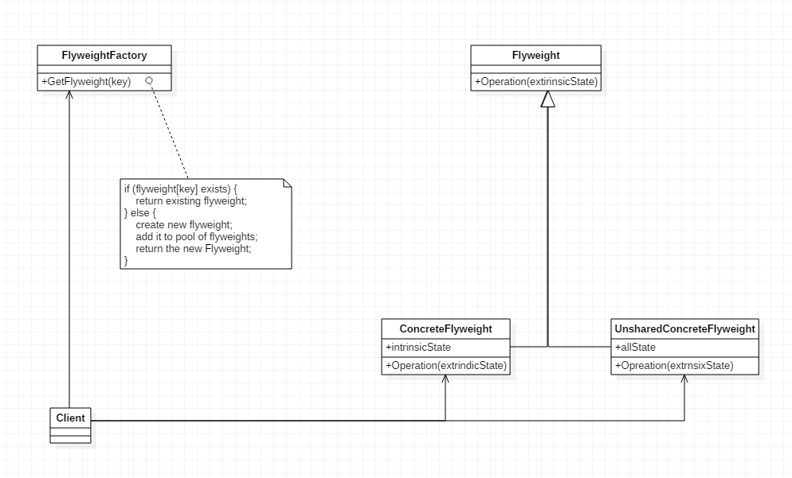

---
layout: post
title: '享元模式 Flyweight'
tags:
    - 设计模式
---  
  
  
  
#   享元模式 Flyweight
  
  
- [享元模式 Flyweight](#享元模式 Flyweight )
  - [示例](#示例 )
  - [动机&意图](#动机意图 )
  - [类别](#类别 )
  - [结构](#结构 )
  - [总结](#总结 )
  
##   示例
  
~~~ts
// 一切皆对象
// 有些是不能对象的
class Font {
    key: string;

    constructor(key: string) {
        this.key = key;
    }
}

class FontFactory {
    // 使用一个池缓存font，如果存在就返回已存在的
    // 此处，创建好之后无法更改，只读
    fontPool: Map<string, Font> = new Map();

    getFont(key: string) {
        if (this.fontPool.has(key)) {
            return this.fontPool.get(key);
        }
        const font = new Font(key);
        this.fontPool.set(key, font);
        return font;
    }
}

const fontFactory = new FontFactory();

console.log(fontFactory.getFont("h"));

~~~
  
##   动机&意图
  
在软件系统中采用纯粹对象方案的问题在于大量细粒度的对象会很块充斥在系统中，从而带来很高的运行时代价---主要指内存需求方面的代价。
如何在避免大量细粒度对象问题的同时，让外部客户程序仍能透明的使用面向对象的方式来进行。
意图：运用共享技术有效的支持大量细密度的对象

运用共享技术有效的支持大量细粒度的对象。
  
##   类别
  
  
- 对象性能模式
  
##   结构
  
  

  
##   总结
  
- flyweight主要解决面向对象的代价问题，一般不触及面向对象的抽象问题
- flyweight采用对象共享的做法来降低系统中对象的个数，从而降低细粒度对象给系统带来的内存压力。在具体实现方面，要注意对象状态的处理（只读）
- 对象的数量太大而导致内存呢开销加大---什么样的数量才算大？这需要我们仔细的根据具体应用情况进行评估，而不能凭空臆断。
- 能否共享
- 如何共享
  