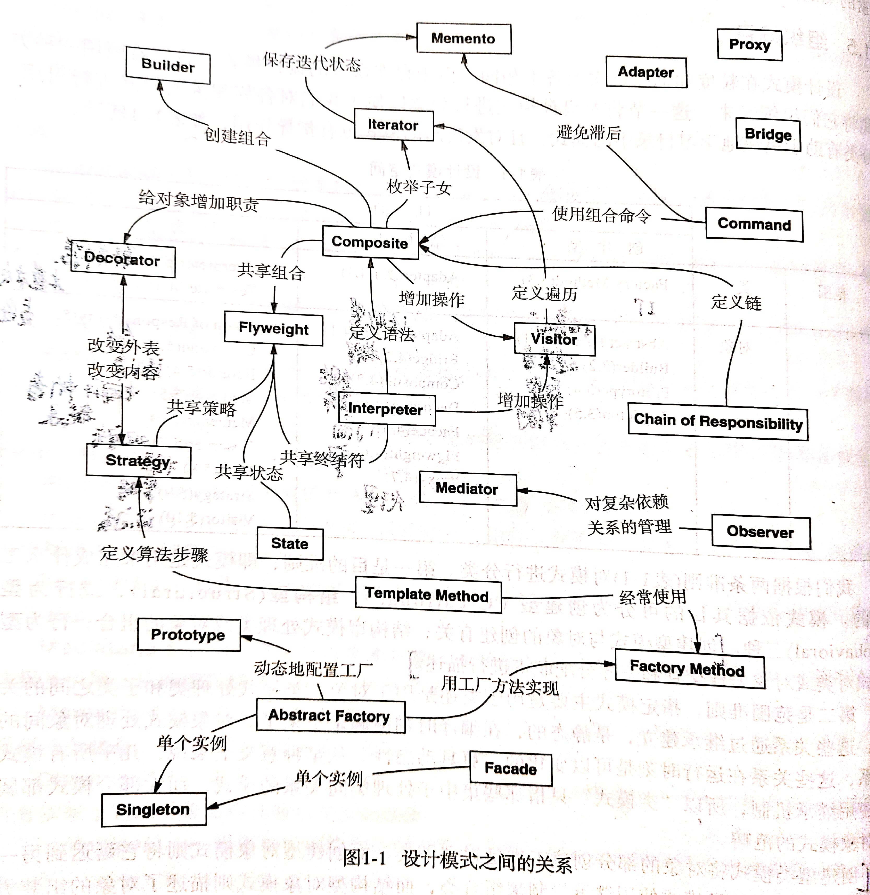

# 设计模式分类 {#title-home}

[TOC]

## 设计模式空间

 | 目的 | 创建型           | 结构型    | 行为型                  |
 | ---- | ---------------- | --------- | ----------------------- |
 | 类   | Factory Method   | Adapter   | Interpreter             |
 |      |                  |           | Template Method         |
 | 对象 | Abstract Factory | Adapter   | Chain of Responsibility |
 |      | Builder          | Bridge    | Command                 |
 |      | Prototype        | Composite | Iterator                |
 |      | Singleton        | Decorator | Mediator                |
 |      |                  | Facade    | Memento                 |
 |      |                  | Flyweight | Observer                |
 |      |                  | Proxy     | State                   |
 |      |                  |           | Strategy                |
 |      |                  |           | Visitor                 |

1. 目的：创建型、结构型、行为型
2. 范围：类、对象

- 创建型模式与对象的创建有关
  - 创建型类模式将对象的部分创建工作延迟到子类
  - 创建型对象模式将它延迟到另一个对象中
- 结构型模式处理类或对象的组合
  - 结构型类模式使用继承机制来组合类
  - 结构性对象模式则描述了对象的组装方式
- 行为型模式对类或对象怎样交互和怎样分配职责进行了描述
  - 行为型类模式通过继承描述算法和控制流
  - 行为型对象模式则描述一组对象怎样协作完成单个对象所无法完成的工作

## 模式关系图形说明

~~~mermaid
  graph LR
    Composite --> |创建组合|Builder;
    Composite --> |枚举子女|Iterator;
    Composite --> |给对象增加职责|Decorator;
    Composite --> |共享组合|Flyweight;
    Composite --> |增加操作|Visitor;

    Iterator --> |保持迭代状态|Memento;

    Command --> |避免滞后|Memento;
    Command --> |使用组合命令|Composite;

    Visitor --> |定义遍历|Iterator;

    ChainOfResponsibility --> |定义链|Composite;

    Interpreter --> |共享终结符|Flyweight;
    Interpreter --> |增加操作|Visitor;
    Interpreter --> |定义语法|Composite;

    State --> |共享状态|Flyweight;
  
    Strategy---|改变内容 改变外表|Decorator;
    Strategy --> |共享策略|Flyweight;

    TemplateMethod --> |定义算法步骤|Strategy;
    TemplateMethod --> |经常使用|FactoryMethod;

    Facade --> |单个实例|Singleton;

    AbstractFactory --> |用工厂方法实现|FactoryMethod;
    AbstractFactory --> |动态的配置工厂|Prototype;
    AbstractFactory --> |单个实例|Singleton;

    Observer --> |对复杂依赖关系的管理|Mediator;

    Proxy;
    Adapter;
    Bridge;
~~~

## 从封装角度进行分类

- 组件协作
  - Template method
  - Strategy
  - oberver/event
- 单一职责
  - Decorator
  - bridge
  - 在软件组件的设计中，如果责任划分的不清晰，使用继承得到的结果往往是随着需求的变化，子类急剧膨胀，同时充斥着大量重复代码（bad smell），这时候的关键是划清责任。
- 对象创建
  - Factory method
  - Abstract factory
  - Prototype
  - builder
- 对象性能
  - Singleton
  - flyweight
- 接口隔离
  - Façade
  - Proxy
  - Mediator
  - adapter
- 状态变化
  - Memento
  - state
- 数据结构
  - Composite
  - Iterator
  - Chain of responsibility
- 行为变化
  - Command
  - visitor
- 领域问题
  - interpreter

[TOP](#title-home) 跳转标题

> [返回首页](/index.html)