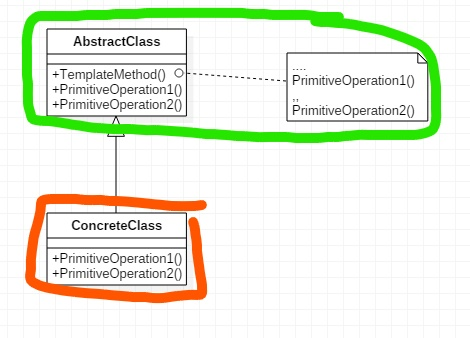

# 模板方法 Template Method {#title-home}

[TOC]

## 场景

在工作中，经常会遇到某些问题，整体处理流程一致，仅仅是其中的某几个步骤不同。这时我们往往会将他们共有的这些步骤给封装起来，形成一个工具类。然后再去分别实现各个具体的应用类，实现其不同的步骤。这样做，就避免了大量的重复代码，只需在应用类中引入工具类即可。

代码如下：

~~~ts
// 工具类，定义三个步骤
class Library {
  step1() {
    console.log("step1");
  }

  step3() {
    console.log("step3");
  }

  step5() {
    console.log("step5");
  }
}

// 应用类，定义剩下的两个步骤和执行方法
class App {
  protected step2() {
    console.log("step2");
  }

  protected step4() {
    console.log("step4");
  }

  // 声明了一个工具类，并调用工具类的方法
  public run() {
    const lib = new Library();
    lib.step1();
    this.step2();
    lib.step3();
    this.step4();
    lib.step5();
  }
}

const app = new App();
app.run();
~~~

输出：

~~~ps
step1
step2
step3
step4
step5
~~~

这样做是可以解决问题的。但是，这样做还是存在一些问题：

- App要在内部声明一个Lib并调用Lib的方法，这使得App开发人员必须对Lib有足够的了解
- 因为App的执行步骤是固定的，这样做，每个App都要重写一遍run方法。

我们可以使用模板方法设计模式来解决这个问题。

## 优化

代码如下：

~~~ts
// 定义run方法
// 定义确定的步骤
// 不确定的步骤仅定义虚函数
class Library {
  step1() {
    console.log("step1");
  }

  step2() {
    return;
  }

  step3() {
    console.log("step3");
  }

  step4() {
    return;
  }

  step5() {
    console.log("step5");
  }

  run() {
    this.step1();
    this.step2();
    this.step3();
    this.step4();
    this.step5();
  }
}

// 应用类继承lib，实现step2 与 step4即可；
class App extends Library {
  step2() {
    console.log("app step2");
  }

  step4() {
    console.log("app step4");
  }
}

const app = new App();

app.run();
~~~

执行结果：

~~~ps
step1
app step2
step3
app step4
step5
~~~

完美解决了上述的问题：

- 由Lib实现run方法，App开发人员并不需要知道具体的执行步骤，只需实现自己所需的步骤即可。
- 减少了大量的重复代码

## 总结

### 分类

- 类行为型模式[^2]
  - 可以看到，使用类继承的方式实现
- 组件协作模式[^2]
  - 不同步骤，类之间的协作

### 意图

定义一个操作中的算法的骨架（==稳定==），而将一些步骤（==变化==，实现或重写）延迟到子类中。TemplateMethod使得子类可以不改变（==复用==）一个算法的结构即可重定义该算法的某些步骤。[^1];

### 结构

- 绿色 稳定
- 红色 变化

### 适用性

- 一次性实现一个算法的不变部分，并将可变的行为留给子类实现。
  - 如实例
- 各子类中的公共行为应被提取出来并集中到一个公共父类中以避免代码重复。
  - 框架常用的基础类
- 控制子类拓展。模板方法只在特定地点调用 hook，这样就只允许在这些点进行拓展
  - 生命周期函数
  - behavior

### 效果

- 提取公共行为，避免代码重复
  - 类库
- 模板方法导致一种反向的控制结构，“别找我们，我们找你” - 好莱坞法则。
  - 这指的是一个父类调用一个子类的操作，而不是相反
  - 晚绑定概念，
    - 示例代码一中，Lib先定义，在App中被调用，是早绑定。
    - 示例代码二中，Lib先定义，App后定义，并重写step2，step4方法，但这些方法已经在Lib中被调用，是晚绑定
    - ==早绑定==：晚的调用早的。

      ~~~mermaid
        graph LR
        App --> Library;
      ~~~

    - ==晚绑定==：早的调用晚的。

        ~~~mermaid
        graph LR
        Library --> App;
        ~~~

- 人们会比较容易忘记去调用已经继承的行为，我们可以将这样一个操作定义为一个模板方法，在模板方法中调用 **hook - 钩子函数**，子类可以重写这个hook函数来**拓展**行为，但是行为的调用在模板方法中已经完成了。来使得父类可以对子类的拓展行为进行控制（*只在固定的地方拓展*）。
  - 生命周期函数

    ~~~mermaid
      graph TD
        step[step:in here call hook]

      Start  --> step;
      step --> End;
    ~~~

[TOP](#title-home) 跳转标题

> [返回首页](/index.html)

[^1]: 设计模式-可复用面向对象软件的基础 - 5.10 TEMPLATE METHOD（模板方法） - 类行为型模式
[^2]: [设计模式分类](./page/degisn_patterns-2.5.html)