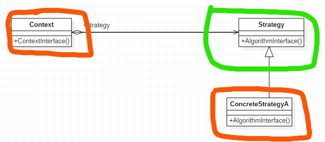

# 策略模式 Strategy {#title-home}

[TOC]

## 场景

假如我们现在需要进行税率的计算，因为各国的税率计算方式不同，我们在程序中需要进行判断。

代码如下：

~~~ts
// 税法计算
// 不同国家，不同计算方法

enum TaxBase {
  CN_Tax,
  US_Tax,
  DE_Tax,
  // 如果要加个法国
  FR_Tax // 更改  违背了开闭原则
}

class SaleOrder {
  calucateTax(country: TaxBase) {
    switch (country) {
      case TaxBase.CN_Tax:
        //doSomething;
        break;
      case TaxBase.US_Tax:
        //doSomething;
        break;
      case TaxBase.DE_Tax:
        //doSomething;
        break;
      case TaxBase.FR_Tax: // 更改 违背了开闭原则，修改代码容易造成bug
        //doSomething;
        break;
    }
  }
}

// 不要静态的看程序设计，要有时间轴的概念，考虑到未来的一些变化

~~~

可以解决问题，调用时传入国家即可。但当我们需要添加一个新的国家时，可以看到，我们要在类的内部进行修改，这就**违背了设计原则中的开闭原则**。而且，在新增功能的同时，有可能会影响到其它的功能。

## 优化

使用策略模式。

~~~ts
// 使用策略模式

// 基类
// 使用 template method 模式构建算法结构
abstract class TaxStrategy {
  abstract calculate();
}

// 工厂
class StrategyFactory {
  newStrategy() {
    //生成 税法对象
    return;
  }
}

class CN_Tax extends TaxStrategy {
  calculate() {
    // doSomething
  }
}
class US_Tax extends TaxStrategy {
  calculate() {
    // doSomething
  }
}
class DE_Tax extends TaxStrategy {
  calculate() {
    //doSomething
  }
}

// 实现法国税务，只需要新增一个类继承基类即可
class FR_Tax extends TaxStrategy {
  calculate() {
    // doSomething
  }
}

class SalesOrder {
  private taxStrategy!: TaxStrategy;

  //创建的时候传入一个税务类，动态使用工厂生成对象
  constructor(strategy: TaxStrategy) {
    this.taxStrategy = strategy;
  }

  calculateTax() {
    return this.taxStrategy.calculate();
  }
}
~~~

代码中，使用*模板方法*定义算法结构，使用*工厂模式*动态绑定税法对象。
新增国家，只需**新建税法类**继承基类，实现计算方法即可。

## 总结

### 分类

- 对象行为型模式
- 组件协作模式[^1]

### 意图

定义*一系列的算法*（==稳定==）把他们一个个封装起来，并且使它们可*互相替换*（==变化==）。本模式使得算法独立于使用它的客户而*变化*（拓展，强化）。

### 结构

- 绿色 稳定
- 红色 变化

### 适用性

- 许多相关的类仅仅是**行为有异**，可以把行为提取出来。策略模式提供了使用多个行为中的一个行为类**配置**一个类的方法。
- 需要使用一个算法的不同变体。
- 算法使用客户不知道的数据。可使用策略模式避暴露复杂的、与算法相关的数据结构。
  - 将数据处理相关的封装起来，用户只需知道如何调用和结果即可
- 一个类定义了多个行为，并且这些行为以if/else或switch的方式区分，可以将他们分别移入不同的strategy。

### 效果

- 提供一系列相关算法
- 一个替代继承的方法。继承提供了另一种支持多种算法或行为的方式。比如生成不同的子类，并重写相关方法。但是这加深了它们的耦合关系。同时将算法的实现与子类的实现混合了起来，使得子类难以被理解、维护和拓展。独立strategy，使其便于理解、切换、拓展
- 消除了一些条件语句。

缺点

- 用户必须了解不同的算法。用户需要了解算法之间的不同，才好去选择使用哪个算法。
- strategy 和 context（调用者）之间的通信开销
- 增加了大量类和对象。可将算法实现为无状态的可共享对象。状态由context维护。
  - 无状态，第二次调用不知道第一次调用发生了什么。比如http。状态是由服务器或浏览器保存改变的。

[TOP](#title-home) 跳转标题

> [返回首页](/index.html)

[^1]: [设计模式分类](./page/degisn_patterns-2.5.html)