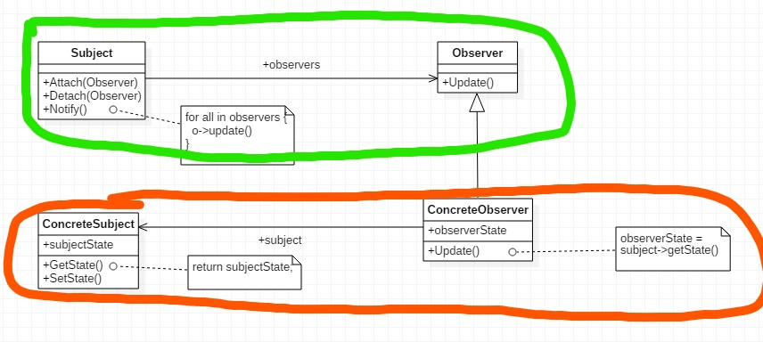

# 观察者模式 Observer （event） {#title-home}

[TOC]

## 案例

实现文本分割器

代码如下：

~~~ts
// 文件分割

// 新需求，需要知道文件分割进度

/**
 * 方法
 * 新增progressBar类
 * App和FileSplit新增progressBar属性
 * split方法更新progressBar
 */

class FileSplit {
  public filePath = "";
  public fileNum = 10;
  public progressBar: ProgressBar | null = null;

  constructor(path: string, num: number, progressBar: progressBar | null) {
    this.filePath = path;
    this.fileNum = num;
    this.progressBar = progressBar;
  }

  split() {
    // 分割文件

    for (let i = 0; i < this.fileNum; i++) {
      //do something

      // 更新进度条
      if (this.progressBar) {
        this.progressBar.setProgress((i + 1) / this.fileNum);
      }
    }

    return true;
  }
}

/**
 * 新增进度条类。
 * progress 保存进度
 * setProgress 设置进度
 */
class ProgressBar {
  public progress = 0;

  setProgress(progress: number) {
    this.progress = progress;
  }
}

class App {
  public textFilePath = "";
  public textFileNumber = 10;

  // 新增一个progressBar对象。
  public progressBar = new ProgressBar();

  // 触发操作
  buttonClick(...args: any[]) {
    this.textFilePath = args[0];
    this.textFileNumber = args[1];

    const fileSplit = new FileSplit(this.textFilePath, this.textFileNumber, this.progressBar);
    fileSplit.split();
  }
}
~~~

FileSplit可以完成文件分割的功能，其中使用了一个ProgressBar来实现进度查看的功能。

观察代码我们可以发现，在App类和FileSplit类中都依赖了ProgressBar，其中，在App类中，ProgressBar作为其组成部分，是一个紧耦合的关系，可以不管（也可以改为抽象，但在这里关系不大）。但在FileSplit类中，ProgressBar是具体的类，是实现细节，其并不一定存在，而且，不同的App实现的ProgressBar也可能不同。此处违背了设计模式原则之一的依赖倒置原则[^principle]，抽象（此处已经是具体类，但可以将progress相关的部分抽象出一个progress类）不应该依赖于实现细节。

## 优化

可以使用观察者模式优化。

~~~ts
// 文件分割

// 新需求，需要知道文件分割进度

/**
 * 方法一
 * 新增progressBar类
 * App和FileSplit新增progressBar属性
 * split方法更新progressBar
 *
 * 违背依赖倒置原则
 * 此时progressBar是实现细节，实现细节应当依赖于抽象
 */

/**
 * 优化
 * 将progressBar抽象
 * 定义一个IProgress接口类
 * 依赖于抽象
 */

/**
 * 支持多个观察者
 * 实现观察者队列
 * add,remove来管理观察者
 */

class FileSplit {
  public filePath = "";
  public fileNum = 10;

  // 改为依赖抽象，符合依赖倒置原则
  // public progressBar: ProgressBar
  // public progressBar: IProgress | null = null;
  // 支持多个观察者
  public progressBar: IProgress[] = [];

  // constructor(path: string, num: number, progressBar: IProgress | null) {
  // 不再传递 IProgress对象
  constructor(path: string, num: number) {
    this.filePath = path;
    this.fileNum = num;
  }

  public addIProgress(progress: IProgress) {
    this.progressBar.push(progress);
  }
  public removeIProgress(progress: IProgress) {
    // do remove
  }

  split() {
    // 分割文件

    for (let i = 0; i < this.fileNum; i++) {
      //do something

      // 更新进度条
      if (this.progressBar.length) {
        this.doProgress((i + 1) / this.fileNum);
      }
    }

    return true;
  }

  // 改良，方便子类修改
  protected doProgress(value: number) {
    // 遍历数组，更新进度条
    this.progressBar.forEach((progress: IProgress) => {
      progress.doProgress(value);
    });
  }
}

/**
 * 新增进度条类。
 * progress 保存进度
 * setProgress 设置进度
 */
class ProgressBar {
  public progress = 0;

  setProgress(progress: number) {
    this.progress = progress;
  }
}

// 定义progress接口类
interface IProgress {
  doProgress(value: number): void;
}

// 继承实现progress接口类
class App implements IProgress {
  public textFilePath = "";
  public textFileNumber = 10;

  // 新增一个progressBar对象。
  public progressBar = new ProgressBar();

  // 触发操作
  buttonClick(...args: any[]) {
    this.textFilePath = args[0];
    this.textFileNumber = args[1];

    // App实现IProgress 接口，传入this
    const fileSplit = new FileSplit(this.textFilePath, this.textFileNumber);
    fileSplit.addIProgress(this);
    fileSplit.split();
  }

  doProgress(value: number) {
    this.progressBar.setProgress(value);
  }
}
~~~

- 抽象出一个IProgress接口，由App接口继承并实现
  - 为什么由App继承实现
    - 我认为，此时，对于FileSplit来说，App才是观察者，其需要查看progress。ProgressBar只是一个工具用来存储和展示progress而已。
    - IProgress接口是为观察者提供服务的
- 由App去更新ProgressBar
- FileSplit内部，由依赖ProgressBar类改为依赖IProgress
  - 依赖于稳定的抽象
  - 将其定义为数组，形成观察者队列
  - 实现add和remove方法
  - 将更新观察者独立为一个protect方法，可以方便子类改写

## 总结

### 分类

- 对象行为型模式
- 组件协作模式[^type]

### 意图

在软件构建过程中，需要为某些对象建立一种”通知依赖关系“---- 一个对象（目标对象）的状态发生改变，所有的依赖对象（观察者对象）都将得到通知，如果这样的关系过于紧密，系统将很难抵御变化。

定义对象间的一种一对多的依赖关系，当一个对象的状态发生改变时，所有依赖于它的对象都得到通知并被自动更新。又名发布-订阅模式（publish-subscribe）。

### 结构

- 绿色 稳定
- 红色 变化
- 此处，观察者还可以去查询目标对象的状态

### 适用性

- 当一个抽象模型有两个方面，其中一个方面依赖于另一个方面。将这二者封装在独立的对象中以使他们可以各自独立的改变和复用。
- 当对一个对象的改变需要同时改变其它对象，而不知道具体有多少对象需要改变
- 当一个对象必须通知其它对象，而它又不能假定其它对象是谁。换言之，你不希望这些对象紧密耦合。
  - event

### 效果

- 目标和观察者间的抽象耦合
  - 目标对象和观察者直接独立改变
  - 一个目标仅知道它的观察者符合接口，却不知道具体的类，这样目标对象和观察者之间的耦合是抽象的和最小的
  - 因为它们之间不是紧密耦合的，所以它们可以被设计在不同的抽象层次。一个处于较低层次的目标对象可以与一个处在较高层次的观察者通信并通知它，保持了系统层次的完整性。如果二者混在一起，势必会出现横跨多个层次的对象或两者必须在同一抽象层次之中。
- 支持广播通信
  - 目标发送的通知不指定接收者，自动推送给已注册的观察者对象
- 观察者自己决定是否要接收通知，目标对象一无所知
- 事件模型

缺点

- 意外的更新
  - 因为目标对象并不知道观察者的存在，其的一个变化可能导致观察者的一系列更新。如果维护不当或定义错误，常常会引起错误的更新且难以捕捉
  - vue的EventBus

[TOP](#title-home) 跳转标题

> [返回首页](/index.html)

[^type]: [设计模式分类](./page/degisn_patterns-2.5.html)
[^principle]: [设计模式原则](./page/degisn_patterns-2.html)