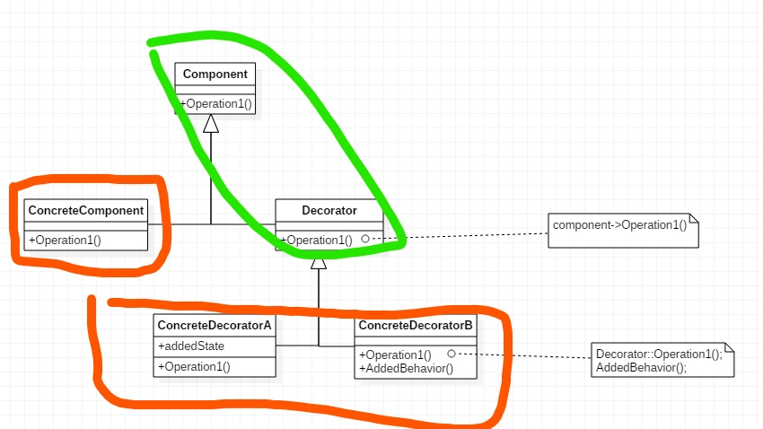

# 装饰器模式 Decorator {#title-home}

[TOC]

## 案例

实现一系列流， 文件流、加密文件流、缓存文件流、加密缓存文件流等等。

代码如下：

~~~ts
/**
 * 流
 * 文件流
 * 加密文件流
 * 缓存文件流
 * 加密缓存文件流
 */
namespace Decorator_demo1 {
  export class Stream {
    read() {
      // do something;
    }
    seek() {
      // do something;
    }
    write() {
      // do something;
    }
  }
  export class FileStream extends Stream {
    read() {
      // do something;
    }
    seek() {
      // do something;
    }
    write() {
      // do something;
    }
  }

  export class CryptFileStream extends FileStream {
    read() {
      // do crypt;
      // 调用父类操作，静态机制
      super.read();
    }
    seek() {
      // do crypt;
      // 调用父类操作，静态机制
      super.seek();
    }
    write() {
      // do crypt;
      // 调用父类操作，静态机制
      super.write();
    }
  }

  export class BufferdFileStream extends FileStream {
    read() {
      // do buffer;
      // 调用父类操作，静态机制
      super.read();
    }
    seek() {
      // do buffer;
      // 调用父类操作，静态机制
      super.seek();
    }
    write() {
      // do buffer;
      // 调用父类操作，静态机制
      super.write();
    }
  }

  export class BufferdCryptFileStream extends FileStream {
    read() {
      // do crypt;
      // do buffer;
      // 调用父类操作，静态机制
      super.read();
    }
    seek() {
      // do crypt;
      // do buffer;
      // 调用父类操作，静态机制
      super.seek();
    }
    write() {
      // do crypt;
      // do buffer;
      // 调用父类操作，静态机制
      super.write();
    }
  }
}

const d1s1 = new Decorator_demo1.FileStream();
const d1s2 = new Decorator_demo1.CryptFileStream();
const d1s3 = new Decorator_demo1.BufferdFileStream();
const d1s4 = new Decorator_demo1.BufferdCryptFileStream();
~~~

- 实现
  - 按部就班，一个一个类的实现了流、文件流、加密文件流、缓存文件流、加密缓存文件流。可以解决问题。
- 问题
  - 如果需要再增加一个种类，图片流及其子类、加密图片流、缓存图片流，或则要再加一处理类别。压缩，又会生成多种子类。长此以往，子类会以爆炸性的速度增长。
  - 不同类之间重复代码众多。
  - 子类职责众多，违背了单一职责原则
  - 众多子类继承父类，只是为了静态调用父类的方法，同时自己也重写了父类的方法。这种又调用又重写的行为，并不易于理解。

## 优化

~~~ts
/**
 * 流
 * 文件流
 * 加密文件流
 * 缓存文件流
 * 加密缓存文件流
 */

namespace Decorator_demo2 {
  export class Stream {
    read() {
      // do something;
    }
    seek() {
      // do something;
    }
    write() {
      // do something;
    }
  }

  export class FileStream extends Stream {
    read() {
      // do something;
    }
    seek() {
      // do something;
    }
    write() {
      // do something;
    }
  }

  export class CryptStream extends Stream {
    // 使用组合替代继承，大大减小了子类数量
    // 是该模式的精髓
    // 使用继承，势必需要一个父类，不断继承，不断膨胀
    // 使用组合，调用的都是同父类的子类，直接使用父类代替。不必关心子类的多少，使用多态的机制进行运行时绑定。
    public stream: Stream;

    constructor(stream: Stream) {
      super();
      this.stream = stream;
    }

    read() {
      // do crypt;
      // 调用父类操作，静态机制
      this.stream.read();
    }
    seek() {
      // do crypt;
      // 调用父类操作，静态机制
      this.stream.seek();
    }
    write() {
      // do crypt;
      // 调用父类操作，静态机制
      this.stream.write();
    }
  }

  export class BufferdStream extends Stream {
    public stream: Stream;

    constructor(stream: Stream) {
      super();
      this.stream = stream;
    }

    read() {
      // do buffer;
      // 调用父类操作，静态机制
      this.stream.read();
    }
    seek() {
      // do buffer;
      // 调用父类操作，静态机制
      this.stream.seek();
    }
    write() {
      // do buffer;
      // 调用父类操作，静态机制
      this.stream.write();
    }
  }
}

const d2s1 = new Decorator_demo2.FileStream();
const d2s2 = new Decorator_demo2.CryptStream(d2s1);
const d2s3 = new Decorator_demo2.BufferdStream(d2s2);
~~~

- 改继承为组合
  - 既然又要调用又要重写，不如机制再类内部新建一个父类对象，调用该对象的方法。便于理解。同时，将该对象声明为基类类型，使得子类并不需要关心引用的对象是谁，在运行时绑定就可以。这样做，就无需再声明类似加密文件流之类的子类。只需将加密流和文件流组合一下便可得到想要的子类对象。大大减小了子类数量
- 继承基类
  - 继承重写基类方法，使其可以为其它子类所引用。

~~~ts
/**
 * 流
 * 文件流
 * 加密文件流
 * 缓存文件流
 * 加密缓存文件流
 */

// 如果子类中有重复属性，将其提升为基类
namespace Decorator_demo3 {
  export class Stream {
    read() {
      // do something;
    }
    seek() {
      // do something;
    }
    write() {
      // do something;
    }
  }

  export class FileStream extends Stream {
    read() {
      // do something;
    }
    seek() {
      // do something;
    }
    write() {
      // do something;
    }
  }

  // 装饰器
  export class DecoratorStream extends Stream {
    public stream: Stream;

    constructor(stream: Stream) {
      super();
      this.stream = stream;
    }
  }

  export class CryptStream extends DecoratorStream {
    // 使用组合替代继承，大大减小了子类数量

    constructor(stream: Stream) {
      super(stream);
    }

    read() {
      // do crypt;
      // 调用父类操作，静态机制
      this.stream.read();
    }
    seek() {
      // do crypt;
      // 调用父类操作，静态机制
      this.stream.seek();
    }
    write() {
      // do crypt;
      // 调用父类操作，静态机制
      this.stream.write();
    }
  }

  export class BufferdStream extends DecoratorStream {
    constructor(stream: Stream) {
      super(stream);
    }

    read() {
      // do buffer;
      // 调用父类操作，静态机制
      this.stream.read();
    }
    seek() {
      // do buffer;
      // 调用父类操作，静态机制
      this.stream.seek();
    }
    write() {
      // do buffer;
      // 调用父类操作，静态机制
      this.stream.write();
    }
  }
}

const d3s1 = new Decorator_demo3.FileStream();
const d3s2 = new Decorator_demo3.CryptStream(d3s1);
const d3s3 = new Decorator_demo3.BufferdStream(d3s2);
~~~

- 观察发现，子类中都有重复的Stream对象，将其提升为Decorator基类，进一步优化代码。

## 总结

### 分类

- 对象结构模式
- 单一职责模式[^type]

### 意图

动态的给一个对象添加一些额外的职责。

某些情况下会“过度的使用继承来扩展对象的功能”，由于继承为类型引入的静态机制（调用父类方法），使得这种扩展方式缺乏灵活性（调用地点规定）；并且随着子类的增多（功能的拓展），各种子类的组合（扩展功能的组合），会导致子类膨胀

如何使“对象功能的扩展”能够根据实际需要来动态的实现？同时避免“拓展功能的增多”带来的子类膨胀问题？从而使得任何“功能扩展变化”导致的影响降为最低？

### 结构

- 绿色 稳定
- 红色 变化

### 适用性

- 在不影响其它对象的情况下，以动态、透明的方式给单个对象添加职责
- 处理那些可以撤销的职责
- 当不能采用生成子类的方法进行扩充时。
  - 一种情况是，可能有大量独立的扩展，为支持每一种组合将产生大量的子类，使得子类数量爆炸式增长（此例）。
  - 另一种情况是，类定义被隐藏，或类定义不能用于生成子类

### 效果

- 通过采用组合而非继承的手法，Decorator模式实现了在运行时动态扩展对象功能的能力，而且可以根据需要扩展多个功能。避免了使用继承带来的 *灵活性差* 和 *多子类衍生*问题
- Decorator类在接口上表现为 is-a Component的继承关系，即Decorator类继承了Component类所具有的接口。但在实现上又表现为 has-a Component的组合关系，即Decorator又使用了另外一个Components类
- Decorator模式的目的并非解决 **多子类衍生的多继承** 问题，Decorator模式应用的要点在于解决 **主体类在多个方向上的功能扩展 == 装饰的含义**

[TOP](#title-home) 跳转标题

> [返回首页](/index.html)

[^type]: [设计模式分类](./page/degisn_patterns-2.5.html)
[^principle]: [设计模式原则](./page/degisn_patterns-2.html)